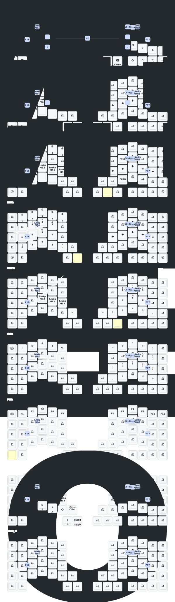

This keeb created by a group of people who loves keyball.

Special Thanks to: <br>
PCB: _[yangxing844](https://github.com/yangxing844)_ <br>
Case: _[delock](https://github.com/delock)_ <br>
Firmware: _[Amos698](https://github.com/Amos698)_ <br>

# Memo

- left ball (mirrored)
- micro controller: NRF52840
- trackball sensor: PMW3610

## トラックボール関連の設定

input processors で行う

- スクロールレイヤー、スナイプレイヤーなどのトラックボールの挙動を変えるレイヤーの設定
- トラックボールを動かしたら自動的にマウススレイヤーをアクティブにする設定

[keyball61_left.overlay](./config/boards/shields/keyball61/keyball61_left.overlay)の`trackball_listener`

### マウスキーの設定 （それ以外のキーを押してマウスレイヤーの自動解除）

- [keyball61_left.keymap](config/keyball61_left.keymap)

```
&zip_temp_layer
```

### マウスポインター加速度の設定

- [keyball61_left.overlay](config/boards/shields/keyball61/keyball61_left.overlay)の`&pointer_accel`内

# keymap drawer


