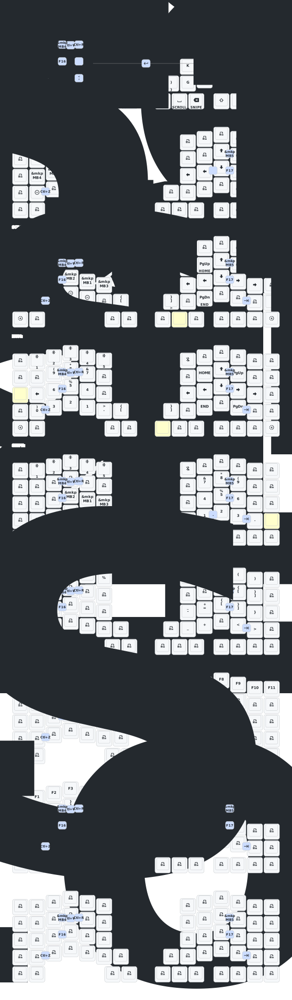

This keeb created by a group of people who loves keyball.

Special Thanks to: <br>
PCB: _[yangxing844](https://github.com/yangxing844)_ <br>
Case: _[delock](https://github.com/delock)_ <br>
Firmware: _[Amos698](https://github.com/Amos698)_ <br>

# Memo

- left ball (mirrored)
- micro controller: NRF52840
- trackball sensor: PMW3610

## トラックボール関連の設定

### スクロールレイヤー、スナイプレイヤーなどのトラックボールの挙動を変えるレイヤーの設定

- [keyball61_left.overlay](./config/boards/shields/keyball61/keyball61_left.overlay)の`&spi1.trackball`内

### カーソル移動速度の設定

[keyball61_left.conf](config/boards/shields/keyball61/keyball61_left.conf) の `CONFIG_PMW3610_CPI`や`CONFIG_PMW3610_SNIPE_CPI`
a

### マウスキー押下によるマウスレイヤーのタイムアウト時間の設定

- [keyball61.keymap](config/keyball61.keymap)

```
&mkp_input_listener { input-processors = <&zip_temp_layer 1 1000>; };

```

# keymap drawer


